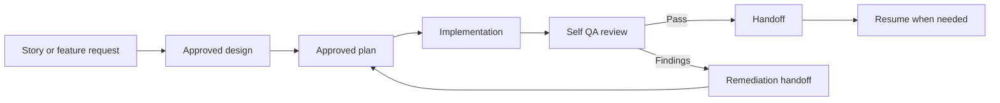
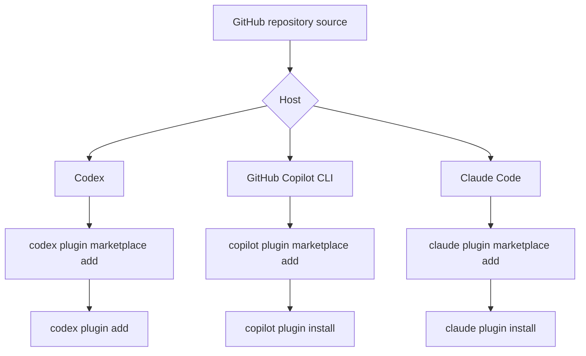

# Agentic Workflow Skills

`agentic-workflow-skills` is the canonical source for eleven reusable workflow skills:

- `story-to-plan`
- `implement-approved-plan`
- `resume-approved-plan`
- `create-handoff`
- `verify-handoff`
- `self-qa-review`
- `critical-review`
- `adversarial-review`
- `critical-adversarial-review`
- `review-findings-validator`
- `critical-review-with-validation`

The repository keeps the canonical workflow behavior in `src/`, generates self-contained host-specific packages into `dist/`, and uses approved artifacts instead of chat history as the handoff between stages.

PowerShell scripts in `scripts/` are supporting build, validation, installation, and packaging helpers. They are part of the delivery toolchain, not the primary purpose of the repository.

For a practical guide to choosing among the review skills, see [docs/review-strategy.md](docs/review-strategy.md).

When work crosses tools, the handoff record is the portability boundary. The next executor should be able to continue from the spec, plan, handoff, and progress files alone.

The independent QA review packet is separate from the implementation handoff. QA should use the story or acceptance criteria, the code, and the evidence, then decide whether the work is story-complete or needs a fix-back handoff.
If QA finds issues, the review findings report should be used to refresh the implementation handoff before the next fix pass.

The review logic itself stays in the review skill family shipped with this package. The `self-qa-review` wrapper routes to those review skills instead of copying their behavior.

## Workflow



When the self-QA pass finds issues, the flow branches through a remediation handoff before planning the fix.

The implementation handoff is artifact-driven because chat context is not a reliable source of truth for approval state, implementation progress, or resume decisions.

## What is included

- canonical skill bodies and metadata under `src/`
- shared references and templates that are bundled into every generated skill
- host metadata overlays under `platform/`
- deterministic rendering scripts under `scripts/`
- package validation scaffolding under `tests/`
- behavioral evaluation scenarios under `tests/scenarios/`
- supporting documentation under `docs/`
- developer manual under `docs/agentic-workflow-manual.md`
- diagram reference under `docs/agentic-workflow-diagrams.md`

## Skill boundary

`agentic-workflow-skills` is the right home for workflow orchestration skills that create, verify, or refresh approved artifacts, plus the dedicated review skills that the self-QA wrapper routes through.

The review skills stay narrower than the orchestration layer because they are reusable from multiple wrapper skills and do not manage artifact lifecycle state themselves.

If a new self-QA flow needs to route between critical, adversarial, or validation variants, keep that routing thin and let the workflow skill call the dedicated review skill rather than embedding the review logic twice.

## Repository layout

```text
agentic-workflow-skills/
├── AGENTS.md
├── CHANGELOG.md
├── LICENSE
├── README.md
├── artifacts/
├── docs/
├── dist/
├── platform/
├── scripts/
├── src/
└── tests/
```

## Install

Install directly from this repository on GitHub using the host you want to run:



### Codex

```powershell
codex plugin marketplace add "https://github.com/jleiva-gap/agentic-workflow-skills"
codex plugin add agentic-workflow-skills@agentic-workflow-skills-local
```

Start a new Codex thread after installation so the plugin skills are loaded.

### GitHub Copilot CLI

```powershell
copilot plugin marketplace add "https://github.com/jleiva-gap/agentic-workflow-skills"
copilot plugin install agentic-workflow-skills@agentic-workflow-skills-local
```

### Claude Code

```powershell
claude plugin marketplace add "https://github.com/jleiva-gap/agentic-workflow-skills"
claude plugin install agentic-workflow-skills@agentic-workflow-skills-local
```

For rebuild, validation, local install, and packaging steps, see [docs/developer-guide.md](docs/developer-guide.md).

## Skills

### `story-to-plan`

Use when a story or feature request must be converted into an approved design specification and implementation plan before coding.

Typical usage:

```text
$story-to-plan story_id=DMS-1228 story_source=.plans/DMS-1228.md
```

This workflow:

- resolves the story input using the shared input contract;
- explores the space before finalizing a design;
- writes the design spec, implementation plan, and handoff artifact;
- stops for approval gates instead of guessing.

### `implement-approved-plan`

Use when an approved plan is ready for task-by-task implementation and verification.

Typical usage:

```text
$implement-approved-plan docs/superpowers/plans/2026-07-17-DMS-1228.md
```

This workflow:

- reads the approved design and plan;
- checks repository state before editing;
- uses baseline verification and test-first implementation;
- updates progress only after evidence exists.

### `resume-approved-plan`

Use when implementation must resume after interruption, context loss, or transfer.

Typical usage:

```text
$resume-approved-plan process_id=2026-07-17-DMS-1228
```

This workflow:

- reconstructs state from artifacts and git;
- resolves the plan, spec, handoff, and progress files from the process id when possible;
- compares plan checkboxes against the code;
- preserves verified work;
- continues safely from the first genuinely pending task.

### `create-handoff`

Use when you need to turn the current approved state into a compact handoff artifact or refresh an existing one before pausing.

Typical usage:

```text
$create-handoff process_id=2026-07-17-DMS-1228
```

This workflow:

- reads the approved spec, plan, progress artifact, and git state;
- resolves standard artifact paths from a process id when possible;
- writes or refreshes the handoff artifact;
- keeps the handoff short enough for a later session to resume quickly;
- avoids repeating background that already belongs in the spec or plan.
- can infer the spec, plan, and progress paths when the current context makes them unambiguous;
- asks for the missing path(s) only when more than one plausible artifact exists.

### `verify-handoff`

Use when you want to confirm that a handoff is still safe to reuse before resuming work.

Typical usage:

```text
$verify-handoff process_id=2026-07-17-DMS-1228
```

This workflow:

- compares the handoff against the plan, spec, progress file, and git state;
- resolves the handoff and approved artifacts from the process id when possible;
- flags stale or contradictory fields before resume starts;
- recommends reuse, refresh, or stop;
- avoids rewriting the handoff unless explicitly asked.

Explicit path mode is still supported when the process id is ambiguous or when you want to pin exact artifacts:

```text
$verify-handoff process_id=2026-07-17-DMS-1228 handoff=docs/superpowers/handoffs/DMS-1228-handoff.md plan=docs/superpowers/plans/2026-07-17-DMS-1228.md
```

### `self-qa-review`

Use when a finished implementation needs an independent review plus a remediation handoff when findings exist.

Typical usage:

```text
$self-qa-review story_file=.plans/DMS-1228.md review_type=critical-with-validation
```

This workflow:

- asks for the review variant when it is not already clear;
- reuses the dedicated review skills shipped in this package for the review pass;
- captures the findings report path;
- refreshes the handoff from the findings report when fixes are needed;
- points the next planning step at `story-to-plan` with the findings report as remediation context.

### `critical-review`

Use when a story or change needs a strict evidence-based review before it is sent to a developer.

Typical usage:

```text
$critical-review story_file=.plans/DMS-1234.md
```

This workflow:

- checks the implementation against the story and repo evidence;
- stays review-only by default;
- keeps tests off unless they are explicitly needed;
- writes a concise evidence-backed report.

### `adversarial-review`

Use when a review needs pressure testing for edge cases, regressions, and hidden failure modes.

Typical usage:

```text
$adversarial-review story_file=.plans/DMS-1234.md
```

This workflow:

- challenges the change from a failure-oriented perspective;
- looks for invalid input, security, data integrity, and performance issues;
- separates confirmed defects from plausible but unconfirmed risks.

### `critical-adversarial-review`

Use when you want one pass that combines strict acceptance-criteria review with adversarial pressure testing.

Typical usage:

```text
$critical-adversarial-review story_file=.plans/DMS-1234.md
```

This workflow:

- verifies each acceptance criterion;
- challenges the same change for boundary conditions and regressions;
- deduplicates overlapping findings.

### `review-findings-validator`

Use when a review report already exists and you need to validate or challenge its findings before sending them onward.

Typical usage:

```text
$review-findings-validator story_file=.plans/DMS-1234.md review_report=.wi/reviews/20260724_120000_codex_critical_review.md
```

This workflow:

- reads the original review and story;
- classifies each finding as validated, duplicated, out of scope, or needing more evidence;
- avoids inventing new findings unless they are necessary to explain a severe issue.

### `critical-review-with-validation`

Use when a review needs a strict first pass and a validation pass before the final report is accepted.

Typical usage:

```text
$critical-review-with-validation story_file=.plans/DMS-1234.md
```

This workflow:

- performs a critical evidence-based review;
- re-checks findings for false positives and weak evidence;
- keeps only the findings that survive validation.

## Host usage

### Codex

Codex renders the generated skill files under `.agents/skills/`.

Use the `$skill-name` invocation style shown in the skill metadata examples.

### Copilot

Copilot renders the generated skill files under `.github/skills/`.

Use the `/skill-name` invocation style shown in the skill metadata examples.

### Claude Code

Claude renders the generated skill files under `.claude/skills/`.

Use the `/skill-name` invocation style shown in the skill metadata examples.

## Input examples

Named input takes precedence over positional input when both are present.

Story file example:

```text
$story-to-plan story_id=DMS-1228 story_source=.plans/DMS-1228.md notes_source=.plans/DMS-1228-notes.md
```

Inline story example:

```text
$story-to-plan story_id=DMS-1228 story_source="Add retry logic for the API client"
```

For maintainer workflows, generated artifacts, validation, and rebuild guidance, see [docs/developer-guide.md](docs/developer-guide.md), [docs/workflow-handoff.md](docs/workflow-handoff.md), [docs/agentic-workflow-manual.md](docs/agentic-workflow-manual.md), and [docs/agentic-workflow-diagrams.md](docs/agentic-workflow-diagrams.md).

## License

See [LICENSE](LICENSE).
