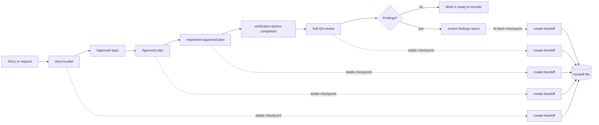
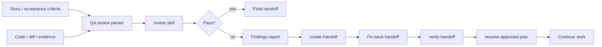
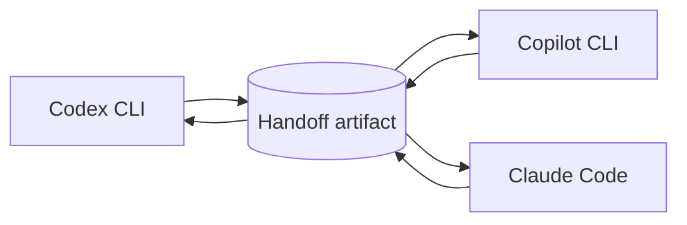
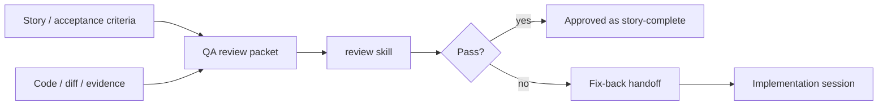
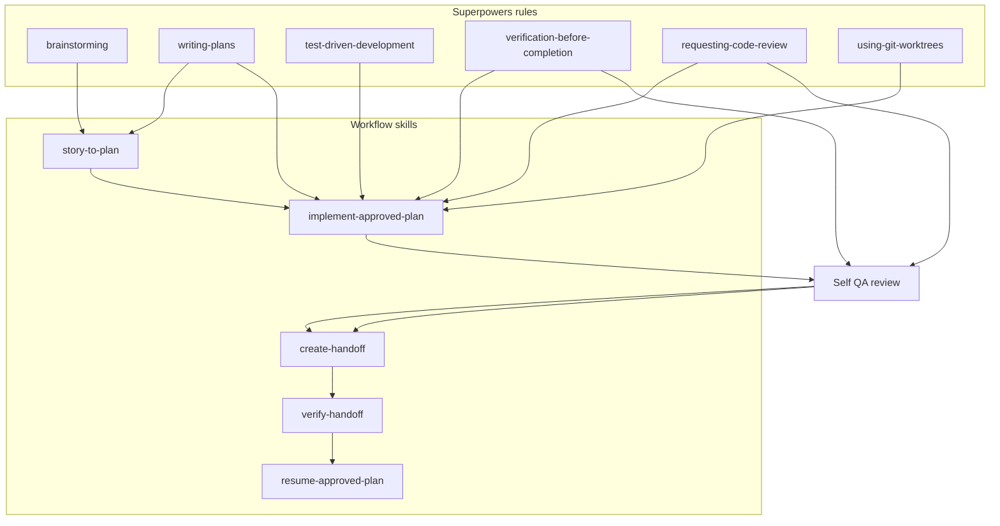

# Agentic Workflow Diagrams

This page gives a visual summary of the workflow skills, the handoff files, and how the process moves between tools.

The goal is simple: make it easy to understand the flow, capture a resume point, and continue later without rebuilding context from scratch.

## Shared terms

- `spec` = approved design intent
- `plan` = approved implementation sequence
- `progress` = verified implementation status
- `handoff` = compact resume snapshot
- `process id` = short code that identifies the exact spec/plan pair

Recommended process id format:

- `YYYY-MM-DD-<story-id>`

Example:

- `2026-07-17-STORY-001`

Use the process id first for `create-handoff`, `verify-handoff`, and `resume-approved-plan`; add explicit paths only when needed.

## 1) Stage checkpoints

This diagram shows that `create-handoff` can happen at any stable boundary.



How to read it:

- `story-to-plan` can create a checkpoint after the spec and plan are approved.
- `implement-approved-plan` can create a checkpoint after a verified milestone.
- `verification-before-completion` makes sure the work is technically complete.
- `Self QA review` makes sure the finished work also passed a human-style review pass, usually through `self-qa-review`.
- `create-handoff` can be used after any of those stable points, not just once at the end.
- If the review finds issues, the findings report becomes the trigger for a fix-back handoff.

Why the self-QA checkpoint is useful:

- it captures the latest verified and reviewed state;
- it reduces repeated review work for the next session;
- it gives the next tool a clean resume point instead of a partially checked branch;
- it lowers the risk of continuing from stale or disputed changes.
- it lets the next implementation pass start from the review findings instead of rediscovering them.

## 2) QA outcomes and fix-back

This view shows how the review pass turns into either a final handoff or a fix-back handoff.



How to read it:

- if QA passes, the work can move to the final handoff path;
- if QA finds issues, the findings report becomes the input that refreshes the implementation handoff;
- `create-handoff` turns the last verified state into a compact resume record.
- `verify-handoff` checks that the record still matches the repo before reuse.
- `resume-approved-plan` restores the task from approved artifacts instead of chat memory.

### Findings refresh loop


How to read it:

- the findings report is the input that tells the handoff what changed;
- `create-handoff` uses that report plus the current repo state to refresh the implementation handoff;
- `resume-approved-plan` then continues the fix pass from the refreshed handoff.

## 3) Cross-tool transfers

This view shows the same handoff moving between Codex, Copilot, and Claude.



How to read it:

- any of the three tools can create the handoff;
- any of the three tools can verify it;
- any of the three tools can resume from it;
- only the invocation syntax changes between tools.

## 3) Independent QA review

This view shows the QA skill as an external review pass.



How to read it:

- the QA reviewer gets the story or acceptance criteria, not the implementation plan;
- the QA reviewer inspects the code and evidence like an external reviewer would;
- the QA pass decides whether the story looks complete;
- if fixes are needed, the QA result can create a fix-back handoff for the implementation session.

What this means in practice:

- QA does not need to know the design spec or plan to judge completeness;
- QA should focus on whether the story is implemented, not why the code was written a certain way;
- if QA finds gaps, the follow-up handoff belongs to the implementation side, not the review side.

## 4) Workflow with skills and Superpowers

This view shows how the workflow skills relate to the Superpowers process rules.



What this means:

- Superpowers define the process discipline.
- The workflow skills turn that discipline into repeatable actions.
- The skills do not replace Superpowers; they follow the rules that Superpowers requires.
- The final review gate is separate from implementation and handoff capture.
- Self QA review can use a review skill such as `requesting-code-review`, a stricter local review skill, or the `self-qa-review` wrapper when the work needs a second pass and a fix-back checkpoint.

Important points:

- The handoff file is the portability boundary.
- The next tool should read the same approved artifacts, not the chat transcript.
- The workflow can create handoffs between stages as well as at the end.
- Any of the three tools can create the handoff, verify it, or resume from it.
- Only the invocation syntax changes between tools.
- If QA produces findings, the next implementation pass should use a refreshed implementation handoff derived from that report.
- If there is only one obvious review findings report, the tool can infer it; otherwise it should ask for the exact path.

### Tool invocation style

- Codex uses `$skill-name`
- Copilot uses `/skill-name`
- Claude Code uses `/skill-name`

## 5) What to include in a handoff

The handoff should be small, explicit, and easy to scan.

Minimum contents:

- process id
- approved spec path
- approved plan path
- current progress path
- current branch or worktree context if relevant
- verified completed tasks
- next task
- review findings report path, if QA found issues
- open blockers
- anything that changed since the last verified state

Example:

```text
Process id: 2026-07-17-STORY-001
Spec: docs/superpowers/specs/2026-07-17-STORY-001-design.md
Plan: docs/superpowers/plans/2026-07-17-STORY-001.md
Progress: docs/superpowers/progress/STORY-001-progress.md
Next: implement task 3
Blockers: none
Review findings: ./.wi/reviews/20260722_140000_copilot_critical_review.md
```

## 6) Resume flow

If you are continuing a paused session:

1. Start from the process id.
2. Resolve the plan, spec, handoff, and progress files.
3. Run `verify-handoff` if anything may have changed.
4. Run `resume-approved-plan`.
5. Finish the remaining implementation work.
6. Run the self QA review step before closing the loop.
7. Refresh the handoff if the review changes anything.

If the handoff is stale, refresh it with `create-handoff` before resuming.
If QA found issues, refresh the implementation handoff from the findings report before resuming fixes.

## 7) Quick rule of thumb

- Use `create-handoff` when pausing or transferring work.
- Use `verify-handoff` before trusting an old handoff.
- Use `resume-approved-plan` when the approved work should continue.
- Use the process id as the default handoff, verify, and resume input.
